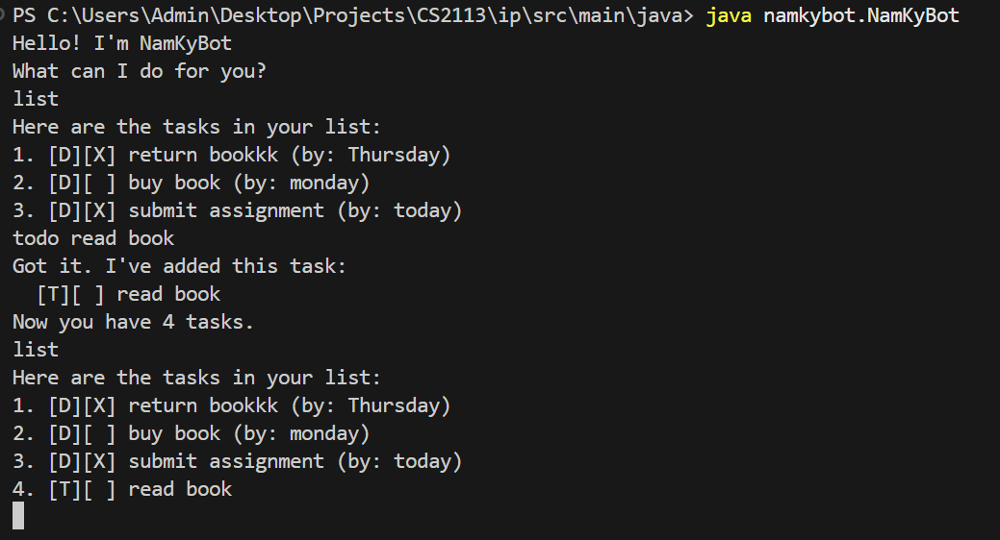

# NamKyBot User Guide
NamKyBot is a simple task management chatbot that helps you keep track of tasks, deadlines, and events directly from the command line.



## Adding to-do tasks
You can add a simple "to-do" task using the `todo` command. These are tasks without specific deadlines or timeframes.  
**Example**: `todo read book`
**Expected output**:
```
Got it. I've added this task:
  [T][ ] read book
```

## Adding deadline tasks
To add a task with a deadline, use the `deadline` command followed by the task description and the deadline after the keyword `by`.  
**Example**: `deadline return book by Monday`
**Expected output**:
```
Got it. I've added this task:
  [D][ ] return book (by: Monday)
```

## Adding event tasks
Event tasks are for activities that happen during a specific timeframe. Use the `event` command, and specify the start and end times using `from` and `to`.  
**Example**: `event interview from 10am to 12pm`
**Expected output**:
```
Got it. I've added this task:
  [E][ ] interview (from: 10am to: 12pm)
```

## List tasks
This command allows you to see the list of your current task, using the `list` command.
**Example**: `list`
**Expected output**:
```
Here are the tasks in your list:
1. [D][ ] return book (by: Monday)
2. [E][ ] interview (from: 10am to: 12pm)
```

## Mark/Unmark your task
This command allows you to mark/unmark your task, using `mark` or `unmark` command, following by the index of the task you want.
**Example**: `mark 1`
**Expected ouput**:
```
Nice job, I have taken note:
  [D][X] return book (by: Monday)
```

## Delete your task
This command allows you to delete your task that you have finished, using `delete` command, following by the index of the task you want.
**Example**: `delete 2`
**Expected output**:
```
Well done, you finished something.
[E][ ] interview (from: 10am to: 12pm)
Only 1 left to go. Letsss gooo !!!
```

## Find your task
You can find your task using the `find` command, following by the keyword of your desired task.
**Example**: `find book`
**Expected output**:
```
Here are the matching tasks in your list:
1.[D][X] return book (by: Monday)
```

## Bye command
Exit NamKyBot with this `bye` command.
**Example**: `bye`
**Expected output**:
```
Bye. Hope to see you again soon!
```